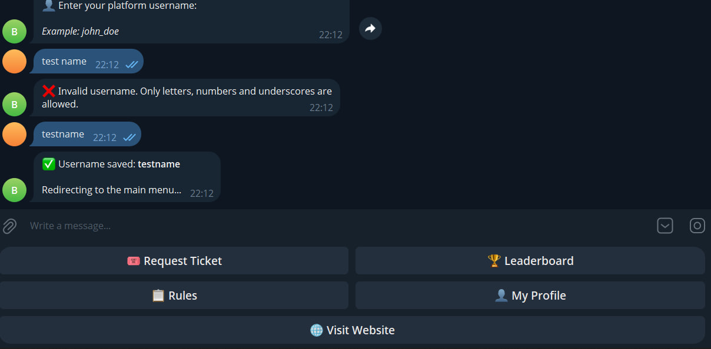
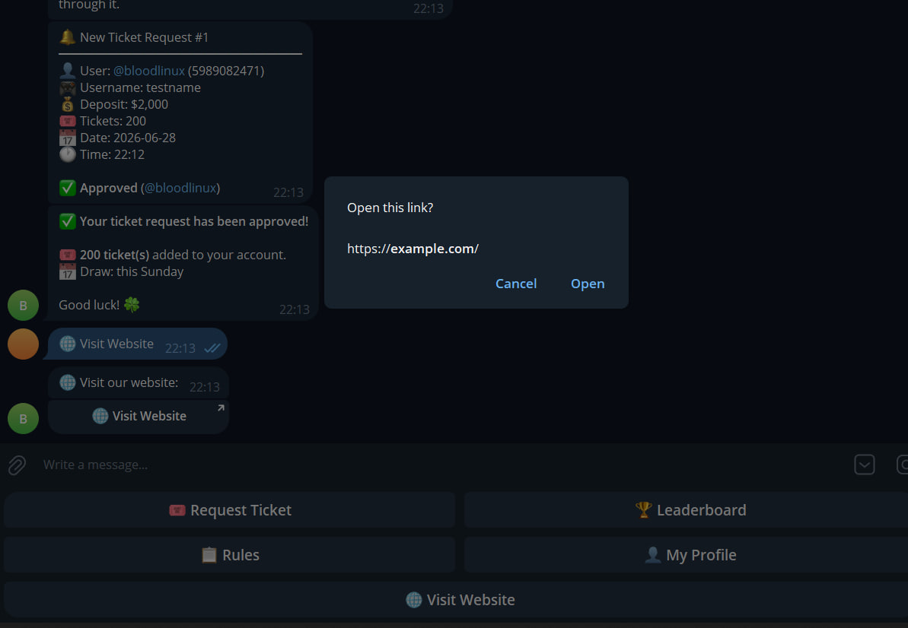
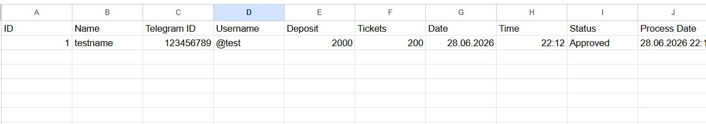
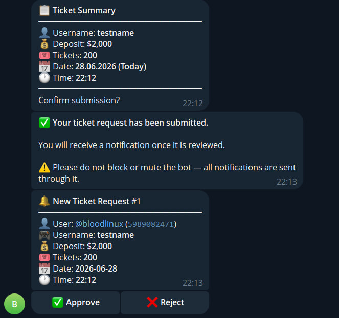
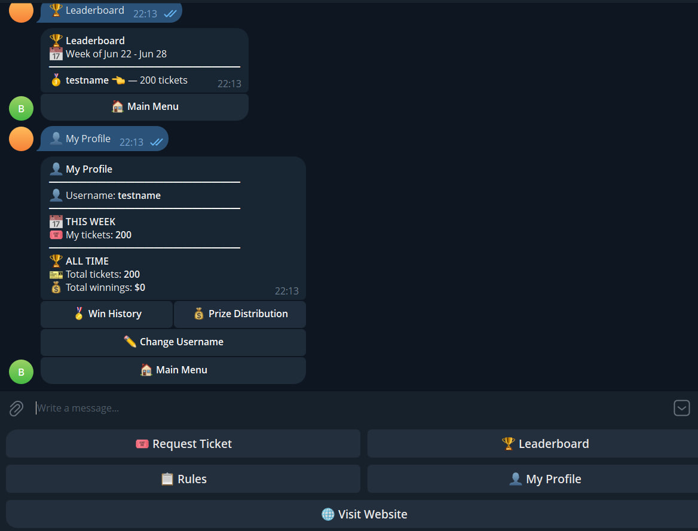
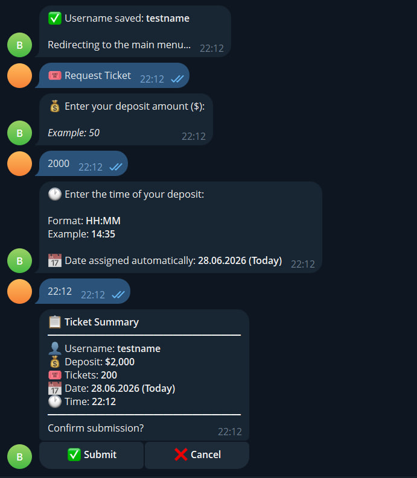

# 🎟 Telegram Raffle Bot

A Telegram bot for running weekly deposit-based raffle campaigns.
Users submit ticket requests, admins approve or reject them, and a leaderboard updates in real time.

---

## Screenshots

**Registration — username validation**


**Ticket request flow — deposit amount, time, and confirmation summary**


**Ticket submitted — admin receives instant notification with Approve / Reject buttons**


**Admin approves — user gets notified automatically**


**Leaderboard and user profile with weekly and all-time stats**


**Google Sheets sync — approved tickets exported automatically**


---

## Features

- **Ticket flow** — users enter deposit amount + time, bot calculates ticket count and shows a confirmation summary before submitting
- **Admin panel** — admins get instant notifications with approve/reject buttons; rejected tickets support a custom reason sent back to the user
- **Duplicate protection** — database-level unique constraint prevents double submissions from double-taps or retried callbacks
- **Leaderboard** — weekly top-10 by ticket count, resets automatically each week
- **Profile** — users see current week tickets, all-time tickets, and total prize winnings
- **Win history** — users can view past raffle wins
- **Google Sheets sync** — optional export of approved tickets to a spreadsheet (toggle via env var)
- **Broadcast** — admins can send a message to all registered users via `/broadcast`
- **Input validation** — strips formatting from amount input, blocks future timestamps, sanity cap on max deposit
- **HTML injection protection** — all user-supplied text is escaped before sending to Telegram

---

## Stack

- Python 3.11
- [aiogram 3.x](https://github.com/aiogram/aiogram) — async Telegram bot framework
- SQLite with WAL mode — persistent storage, survives restarts
- gspread + google-auth — optional Google Sheets integration
- Railway — deployment (`railway.toml` included)

---

## Project Structure

```
├── bot.py              # Entry point, dispatcher setup
├── config.py           # All settings via env vars
├── database.py         # SQLite layer — all queries in one place
├── keyboards.py        # Reusable keyboard builders
├── init_db.py          # Standalone DB initializer
├── handlers/
│   ├── start.py        # Registration flow
│   ├── ticket.py       # Ticket request FSM
│   ├── admin.py        # Approve / reject / stats / broadcast
│   ├── leaderboard.py
│   ├── profile.py
│   └── rules.py
├── utils/
│   ├── security.py     # escape_html, safe_int, callback parser
│   ├── sheets.py       # Google Sheets integration
│   └── time_utils.py   # Timezone-aware date/time helpers
└── locales/
    └── i18n.py         # All bot strings in one place
```

---

## Setup

1. Clone the repo and install dependencies:

```bash
pip install -r requirements.txt
```

2. Copy `.env.example` to `.env` and fill in your values:

```env
BOT_TOKEN=your_telegram_bot_token
ADMIN_IDS=123456789,987654321
DB_PATH=data/raffle.db
TIMEZONE=UTC

# Optional
GOOGLE_SHEETS_ENABLED=false
GOOGLE_SHEET_ID=
```

3. Initialize the database:

```bash
python init_db.py
```

4. Run:

```bash
python bot.py
```

For Railway — just push the repo, `railway.toml` handles the rest.

---

## How It Works

Each $10 deposit = 1 raffle ticket. Users submit a request with their deposit amount and time; admins verify and approve or reject it. Every Sunday a draw is held and winners are recorded in the database.

Prize pool: $500 / $300 / $200 (configurable in `config.py`).
